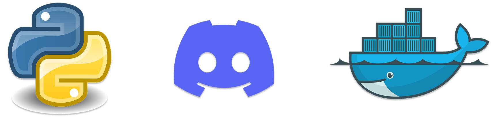
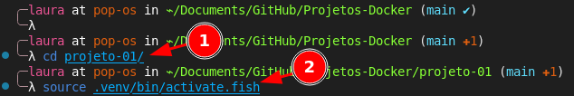
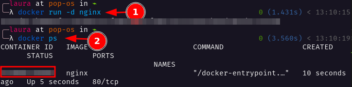
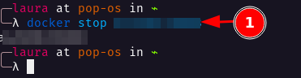
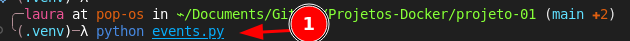
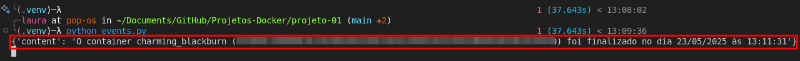
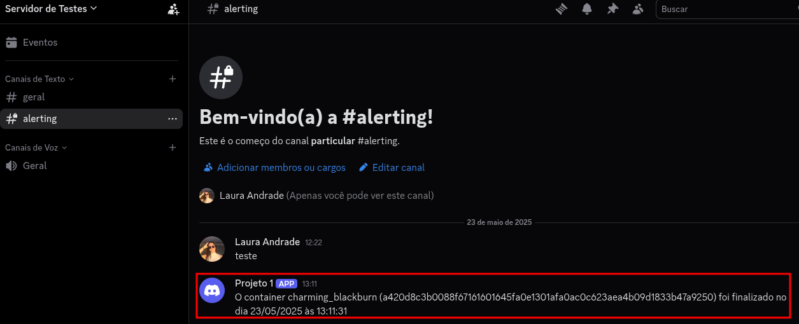

<p align="center">
  
</p>
<br>

# Explicação do Projeto 1

Este projeto faz parte dos meus estudos no [curso do Mateus Müller](https://www.udemy.com/course/docker-basico-ao-avancado/), com o objetivo de aprender ainda mais sobre Docker e automação. A ideia principal é monitorar automaticamente quando um container é finalizado e, a partir disso, enviar uma notificação para um canal no Discord usando um webhook. Além disso, registrei todo o processo e os testes com várias imagens no README, para facilitar a visualização e reforçar o aprendizado. Esse projeto me ajudou a entender na prática como integrar o Docker com outras ferramentas e como automatizar tarefas de administração de containers.

# Etapas do Projeto

## `1` Editar o arquivo `docker.service`

> [!IMPORTANT]
> Essa etapa deve ser realizada no terminal da sua `máquina`

### ➡️ Por que?

Para permitir que a API do Docker seja acessada via **socket TCP**, facilitando integrações externas, como monitorar eventos de containers a partir de um script Python.

> \[!WARNING]
> ⚠️ **Aviso Importante de Segurança**
>
> Esta configuração expõe a API do Docker na rede através de **TCP sem autenticação ou criptografia** (`tcp://0.0.0.0:2375`).
> **Não use isso em ambientes de produção!**
>
> ✅ Recomendações:
>
> * Usar somente para **testes locais** ou em uma **rede isolada**.
> * Se for necessário expor em produção, configure **TLS** e **autenticação** seguindo a documentação oficial:
>   [🔗 Docker Secure TCP](https://docs.docker.com/engine/security/protect-access/).

### ➡️ Como?

Abra o arquivo de configuração:

```bash
sudo nano /usr/lib/systemd/system/docker.service
```

### ➡️ Linha a ser alterada:

```ini
ExecStart=/usr/bin/dockerd -H fd:// -H tcp://0.0.0.0:2375 --containerd=/run/containerd/containerd.sock
```

➡️ Isso adiciona o parâmetro `-H tcp://0.0.0.0:2375`, que expõe o serviço do Docker para conexões via TCP.

---

### ✅ **Arquivo completo com a alteração:**

```ini
[Unit]
Description=Docker Application Container Engine
Documentation=https://docs.docker.com
After=network-online.target nss-lookup.target docker.socket firewalld.service containerd.service time-set.target
Wants=network-online.target containerd.service
Requires=docker.socket

[Service]
Type=notify
ExecStart=/usr/bin/dockerd -H fd:// -H tcp://0.0.0.0:2375 --containerd=/run/containerd/containerd.sock
ExecReload=/bin/kill -s HUP $MAINPID
TimeoutStartSec=0
RestartSec=2
Restart=always
StartLimitBurst=3
StartLimitInterval=60s
LimitNPROC=infinity
LimitCORE=infinity
TasksMax=infinity
Delegate=yes
KillMode=process
OOMScoreAdjust=-500

[Install]
WantedBy=multi-user.target
```

---

### ➡️ Reiniciar o daemon do `systemd` e o Docker:

```bash
sudo systemctl daemon-reexec
sudo systemctl daemon-reload
sudo systemctl restart docker
```

✅ Agora o Docker estará ouvindo na porta **2375** via TCP.

---

## `2` Inicializar o ambiente Python

> [!IMPORTANT]
> Essa etapa deve ser realizada no seu terminal do `VSCode`

Crie e ative o ambiente virtual:

```bash
python3 --version
python3 -m venv .venv
source .venv/bin/activate
```

➡️ **Se você usa o fish shell (assim como eu):**

```fish
source .venv/bin/activate.fish
```

---

## `3` Instalar dependência e criar script

> [!IMPORTANT]
> Essa etapa de `Instalar o pacote docker`, deve ser realizada no seu terminal do `VSCode`

### ➡️ Instalar o pacote `docker`:

```bash
pip install docker
```

---

### ➡️ Criar o arquivo `events.py`:

```python
import docker
import requests
from datetime import datetime

client = docker.DockerClient(base_url='unix://var/run/docker.sock')
webhook_url = "<coloque a URL do seu webhook do Discord aqui>"

for event in client.events(decode=True, filters={"event": "die"}):
    container_id = event["id"]
    container_name = event["Actor"]["Attributes"]["name"]
    epoch_time = event["time"]
    data = datetime.fromtimestamp(epoch_time).strftime("%d/%m/%Y")
    hora = datetime.fromtimestamp(epoch_time).strftime("%H:%M:%S")

    payload = {
        "content": f"O container {container_name} ({container_id}) foi finalizado no dia {data} às {hora}"
    }

    print(payload)
    requests.post(webhook_url, data=payload)
```

---

## `4` Criar o Webhook no Discord

➡️ Abra o seu discord:

### `(parte 1):` Webhook no Discord 

1. No canto inferior esquerdo, clique no `+` para Adicionar um servidor


### `(parte 2):` Webhook no Discord 

1. Clique em `Criar o meu`


### `(parte 3):` Webhook no Discord 

1. Clique em `Para meus amigos e eu`


### `(parte 4):` Webhook no Discord 

1. Dê um nome ao servidor
2. Clique em `Criar`


### `(parte 5):` Webhook no Discord 

1. Em canais de texto, clique no `+` para criar canal


### `(parte 6):` Webhook no Discord 

1. Selecione o tipo como `Texto`
2. Dê um nome para o canal

> [!NOTE]
> 3. Optei em deixar o canal como privado, mas vai da sua preferência

4. Clique em `Próximo`


### `(parte 7):` Webhook no Discord 

1. Clique em `Pular`


### `(parte 8):` Webhook no Discord 

1. No canal criado, clique em `...` para abrir as opções de canal


### `(parte 9):` Webhook no Discord 

1. Clique em `Editar canal`


### `(parte 10):` Webhook no Discord 

1. Clique em `Integrações`


### `(parte 11):` Webhook no Discord 

1. Clique em `Criar webhook`


### `(parte 12):` Webhook no Discord 

> [!NOTE]
> Você provavelmente já terá um webhook criado, vai da sua preferência usá-lo ou criar outro.
> Eu usei o padrão mesmo.

1. Clique no `Webhook`


### `(parte 13):` Webhook no Discord 

1. Dê o nome de sua preferência
2. Copie a `URL`

> [!IMPORTANT]
> Essa é a URL que deve ser alterada na linha 6 do arquivo [events.py](https://github.com/andrrade/Projetos-Docker/blob/main/projeto-01/events.py):

```py
webhook_url = "<coloque a URL do seu webhook do Discord aqui>"
```

3. Clique em `Salvar alterações`


## `5` Testando

### `(parte 1):` Testes

> [!IMPORTANT]
> Essa etapa deve ser realizada no seu terminal do `VSCode`

> [!NOTE]
> Esses são os passos da etapa 1, se você fez tudo certo e já está no ambiente `venv` nem precisa fazer isso.

1. Verifique eue você está na pasta correta

```sh
cd projeto-01/
```

2. Verifique se o ambiente `venv` está ativado

> [!NOTE]
> Usei `.fish` porque o meu terminal é o fish

```sh
.venv/bin/activate.fish
```



### `(parte 2):` Testes

> [!IMPORTANT]
> Essa etapa deve ser realizada no terminal da sua `máquina`

1. Execute o seguinte comando para criar um `container nginx`:

```sh
docker run -d nginx
```

2. Dê um `docker ps` para ver o seu container criado e copie o `ID` dele:

```sh
docker ps
```



### `(parte 3):` Testes

1. Dê um `docker stop <ID>` para parar o container criado

```sh
docker stop <ID>
```



### `(parte 4):` Testes

> [!IMPORTANT]
> Essa etapa deve ser realizada no seu terminal do `VSCode`

1. Execute o seguinte comando:

```sh
python events.py
```



Ele mostrará a mensagem com os dados do container que foi parado, informando também a data e hora:



### `(parte 5):` Testes

Ao abrir o seu canal criado no discord, você também terá sido notificado.



---

✅ **Pronto!** Agora, sempre que um container for finalizado, você receberá automaticamente uma notificação via **Discord**.
